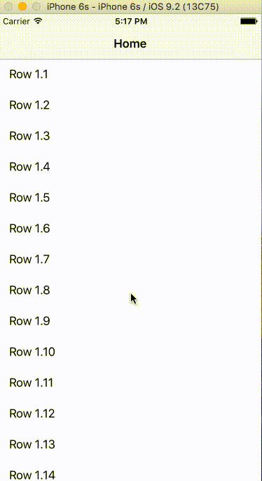

# TableScrollNavigation
[](https://travis-ci.org/Cyrus Chan/TableScrollNavigation)
[](http://cocoapods.org/pods/TableScrollNavigation)
[](http://cocoapods.org/pods/TableScrollNavigation)
[](http://cocoapods.org/pods/TableScrollNavigation)
## Description
A subclass of UINavigationController that provides a table on top of navigation bar to show the stack of the navigations"

This CocoaPod provides the ability to show a stack of navigation on your app through a table at the top of navigation bar. The table is scrolling to maximize the content view. It is similar to the navigation bar you can see in Explore tab of the App Store where users can see their navigation stacks of the categories and sub-categories that they select
## Screenshot
<p align="center">
  
</p>


## Usage

To run the example project, clone the repo, and run `pod install` from the Example directory first.

Make sure to use subclass of `TableScrollNavigationController` for your `UINavigationController` and subclass of `TableScrollNavigationViewController` for your `UIViewController`.

###TableScrollNavigationController
This is the class that will create the navigation table on top of the navigation bar for you. You usually don't have to do anything for this class. You can either set the class of your `UINavigationController` in your storyboard, or create programmatically a `TableScrollNavigationController` instance in your code.

###TableScrollNavigationViewController
This class will attach the scroll view you have to the navigation bar(bar + table on top of it) so it will follow the scroll with the scroll view. It will also push a navigation item to `TableScrollNavigationController` to add the item on the table on top of the navigation bar.

Use `attachScrollableView(_:)` to attach your scrollView so navigation bar will start follow it.
```swift
    override func viewDidLoad() {
        attachScrollableView(tableView)
        
        super.viewDidLoad()
    }
```
Use `pushViewController(_:animated:title:)` to push VC to `TableScrollNavigationController` and add an item to the table on top of the navigation bar.
```swift
    func tableView(tableView: UITableView, didSelectRowAtIndexPath indexPath: NSIndexPath) {
        let vc = self.storyboard?.instantiateViewControllerWithIdentifier("ViewController") as! ViewController
        if let nc = navigationController as? TableScrollNavigationController{
            nc.pushViewController(vc, animated: true, title: "Section 2.1")
            
        }
    }
```

## Installation

TableScrollNavigation is available through [CocoaPods](http://cocoapods.org). To install
it, simply add the following line to your Podfile:

```ruby
pod "TableScrollNavigation"
```

## Author

Cyrus Chan, chan1cyrus2@gmail.com

## License

TableScrollNavigation is available under the MIT license. See the LICENSE file for more info.
